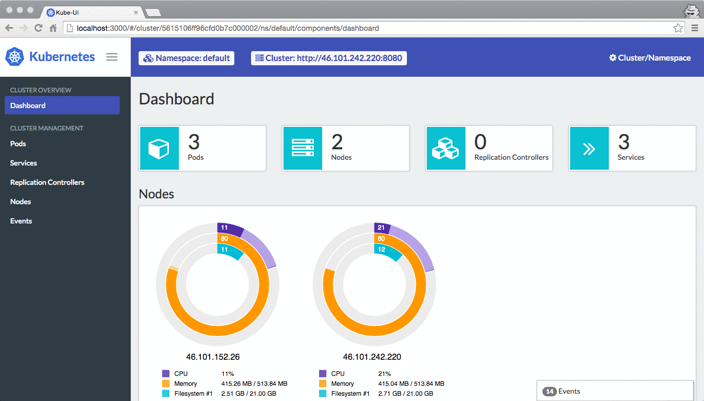

# Kube-UI [](https://travis-ci.org/SebastianM/kube-ui) (TODO: change travis badge to kubernetes repo)
> Join the UI discussion at: https://groups.google.com/forum/#!forum/kubernetes-sig-ui

**Kube-UI** is a web-based user interface for displaying & managing the state of one or more Kubernetes clusters.



## Working with the Kubernetes UI
This document explains how to work with the Kubernetes UI. For information on how to access and use it, see [docs/ui.md](docs/ui.md).

## Installing dependencies
There are two kinds of dependencies in the UI project: tools and frameworks. The tools help
us manage and test the application. They are not part of the application. The frameworks, on the other hand, become part of the application, as described below.

* We get the tools via `npm`, the [node package manager](https://www.npmjs.com/). 
* We get the frameworks via `bower`, a [client-side package manager](http://bower.io/).

Before you build the application for the first time, run this commands:

```
npm install
bower install
```

## Building and serving the app

### Building/Serving the app for development

#### Serving the UI
To build the application for development, run this command:

```
./node_modules/.bin/gulp serve
```

The `gulp serve` command builds the application for development (e.g., without uglification of js files or minification of css files) and starts a local webserver (`http://localhost:3000`). I starts a file watcher that rebuilds the generated files every time the source files are updated. (Note: the file watcher does not support adding or deleting files. It must be stopped and restarted to pick up additions or deletions).

The `dist` and `.tmp` directories and its contents are generated by the build. All of the other files are source or project files, such as tests, scripts and documentation.

#### Starting the Go server
Besides running the `gulp serve` command, you need to start the Kube-UI Go Server that is located in the `/server` directory:

1. Install [Godep](https://github.com/tools/godep#install)
2. Run `godep go run server/kube-ui.go`

This starts the server under port 8080.

### Building the app for production
To build the application for production, run this command:

```
./node_modules/gulp build
```

Like `npm start`, it runs `bower install` to install and/or update the framework dependencies, but then it runs `gulp build` to generate a production version of the application. The `build` target builds the application for production (e.g., with uglification of js files and minification of css files), and does not run a file watcher, so that it can be used in automated build environments.


## Building a new visualizer or component
See [master/components/README.md](master/components/README.md).

## Testing
Currently, the UI project includes both unit-testing with [Karma](http://karma-runner.github.io/0.12/index.html) and end-to-end testing with [Protractor](http://angular.github.io/protractor/#/).

### Unit testing with Karma
To run the existing Karma tests:

* Edit the Karma configuration in `karma.config.js`, if necessary.
* Run the tests:
* Run the tests. The console should show the test results.

```
./node_modules/.bin/gulp test:unit
```

To run new Karma tests for a component, put new `*.spec.js` files under the appropriate `src/components` directories.

[]()